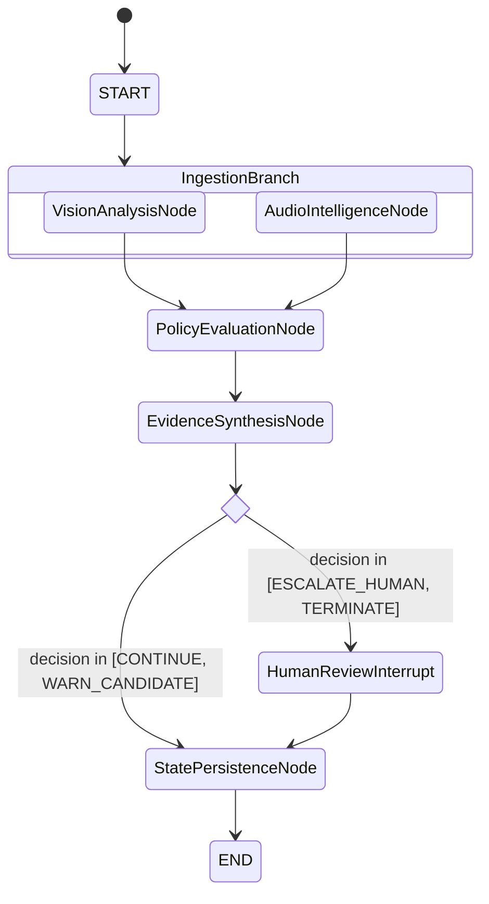

# LangGraph Workflows & State Lifecycle

## 1. Graph Topology

The orchestration pipeline uses LangGraph's `StateGraph` with parallel branching and dynamic conditional routing:



## 2. State Accumulation Pattern
To retain history across graph transitions without mutating historical frames, fields like `detected_objects`, `visual_anomalies`, `audio_anomalies`, `policy_violations`, and `evidence_events` use:

```python
from typing import Annotated, List, Dict, Any
import operator

# In ProctorSessionState
detected_objects: Annotated[List[Dict[str, Any]], operator.add]
visual_anomalies: Annotated[List[Dict[str, Any]], operator.add]
policy_violations: Annotated[List[Dict[str, Any]], operator.add]
evidence_events: Annotated[List[Dict[str, Any]], operator.add]
```

## 3. Checkpointing Strategy
- **Development/Testing**: In-memory `MemorySaver` preserves session execution history for fast deterministic testing.
- **Production Deployment**: Postgres checkpointer (`AsyncPostgresSaver`) records multi-frame sessions across persistent database clusters.
